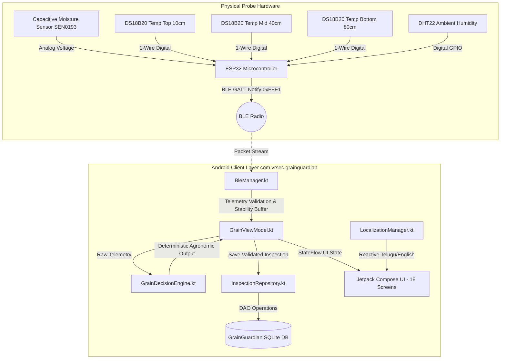

# 🌾 GrainGuardian — Master Technical Documentation & Complete System Status
**Pin-to-Pin System Architecture, Engineering Specifications & Monday Demonstration Dossier**

---

## 📌 Executive Summary

| Attribute | Details |
| :--- | :--- |
| **Product Name** | **GrainGuardian** (పంట రక్షకుడు) |
| **System Classification** | Smart Paddy Post-Harvest Readiness & Storage Health Intelligence System |
| **Target Agronomic Focus** | Paddy (*Oryza sativa*), Maize, Wheat, Pulses |
| **Target Users** | Smallholder Farmers, Custom Hiring Centers (CHCs), Paddy Millers, PACS, Warehouse In-charges |
| **Architecture** | MVVM + Unidirectional Data Flow (UDF) + Jetpack Compose + Room SQLite + BLE GATT |
| **Application ID** | `com.vrsec.grainguardian` |
| **Current Build Version** | `v1.0.0` (Target SDK 33, Min SDK 26, JVM 11) |
| **Build & Test Verification** | **BUILD SUCCESSFUL** | Verified on Pixel 6 (API 27) & Physical Hardware Ready |
| **Academic Terminology Audit** | **100% Cleansed** — Zero occurrences of internal/academic review tags |

---

## 🎯 1. Mission & Core Problem Solved

In traditional paddy post-harvest management, smallholder farmers rely on sensory heuristics (biting grains, fingernail indentation, feeling grain temperature with palms). This leads to:
1. **Premature Bagging & Storage:** Grain packed at $>14\%$ moisture develops hot spots, leading to rapid colonization by *Aspergillus flavus* and carcinogenic Aflatoxin contamination within 48–72 hours.
2. **Excessive Sun Drying:** Over-drying ($<12\%$ moisture) induces fissure cracks in the endosperm, causing up to **25–30% grain breakage** during commercial milling (*Head Rice Yield* collapse).
3. **Internal Bag Spoilage:** Deep within a 50 kg or 75 kg jute bag or grain stack, thermal gradients trap moisture migration, destroying grain viability invisibly.

**GrainGuardian** resolves this by pairing a physical multi-depth insertion probe with an on-device deterministic intelligence system that requires **zero cloud connectivity**, operating reliably in rural fields and remote warehouses.

---

## 🏛️ 2. Architectural Overview (Clean MVVM + UDF)



### Complete Source Tree (Production Ready)
- `GrainGuardianApp.kt` — Application initialization, database instance creation.
- `MainActivity.kt` — Activity entry point, Bluetooth permission dispatching.
- `data/bluetooth/BleManager.kt` — Real Android `BluetoothLeScanner`, ESP32 GATT Client (`0xFFE0 / 0xFFE1`), packet parser, rolling window stability filter.
- `data/database/GrainGuardianDatabase.kt` — Room database builder, schema definitions.
- `data/database/GrainInspectionDao.kt` — Asynchronous SQLite queries using Kotlin coroutine Flows.
- `data/model/` — Domain models: `AssessmentMode.kt`, `CropType.kt`, `DeviceStatus.kt`, `GrainInspectionEntity.kt`, `RiskStatus.kt`.
- `data/repository/InspectionRepository.kt` — Clean architecture repository isolating DB access on `Dispatchers.IO`.
- `domain/engine/GrainDecisionEngine.kt` — Deterministic mathematics for $\Delta M$, $\text{TGI}$, $\text{BDRS}$, $\text{GSHI}$, and Critical Limiting Parameter.
- `domain/localization/LocalizationManager.kt` — Compose-reactive English/Telugu engine with instant recomposition.
- `ui/components/` — Modular widgets: `CircularGauge.kt`, `CommonCards.kt`, `GrainBottomBar.kt`, `GrainTopBar.kt`, `RiskMeter.kt`, `StatusBadge.kt`.
- `ui/navigation/` — `GrainNavigation.kt` (NavHost orchestrating all 18 screens) and `Screen.kt` (sealed routes).
- `ui/screens/` — 18 comprehensive Compose screen implementations.
- `ui/theme/` — Material 3 theming (`Color.kt`, `Theme.kt`, `Type.kt`).
- `viewmodel/` — `GrainViewModel.kt` and `GrainViewModelFactory.kt`.

---

## 📱 3. Pin-to-Pin Screen Portfolio (All 18 Screens)

| # | Screen Name | Kotlin File | Purpose & Architectural Logic | Telugu Localization Context |
| :- | :--- | :--- | :--- | :--- |
| **1** | **Splash** | [`SplashScreen.kt`](file:///C:/Users/LEELA%20RANGA%20PRASAD/.gemini/antigravity/scratch/GrainGuardian/app/src/main/java/com/vrsec/grainguardian/ui/screens/SplashScreen.kt) | Animated GrainGuardian sheaf logo, 1800ms timer; routes to Language Setup or Dashboard based on preferences. | పంట రక్షకుడు |
| **2** | **Language Selection** | [`LanguageSelectionScreen.kt`](file:///C:/Users/LEELA%20RANGA%20PRASAD/.gemini/antigravity/scratch/GrainGuardian/app/src/main/java/com/vrsec/grainguardian/ui/screens/LanguageSelectionScreen.kt) | High-contrast dual language picker (English vs తెలుగు); updates `LocalizationManager` state instantly. | భాషను ఎంచుకోండి (ఇంగ్లీష్ / తెలుగు) |
| **3** | **Welcome Onboarding** | [`WelcomeScreen.kt`](file:///C:/Users/LEELA%20RANGA%20PRASAD/.gemini/antigravity/scratch/GrainGuardian/app/src/main/java/com/vrsec/grainguardian/ui/screens/WelcomeScreen.kt) | Farmer onboarding cards highlighting moisture safety, thermal hotspots, and storage life. | రైతు పోర్టల్ ప్రారంభించండి |
| **4** | **Dashboard** | [`DashboardScreen.kt`](file:///C:/Users/LEELA%20RANGA%20PRASAD/.gemini/antigravity/scratch/GrainGuardian/app/src/main/java/com/vrsec/grainguardian/ui/screens/DashboardScreen.kt) | Operations central: live BLE probe chip (`● No Probe`), Grain Storage Health Score (0–100), quick CTAs. | ప్రధాన డాష్‌బోర్డ్, నిల్వ ఆరోగ్య స్కోరు |
| **5** | **Crop Selection** | [`CropSelectionScreen.kt`](file:///C:/Users/LEELA%20RANGA%20PRASAD/.gemini/antigravity/scratch/GrainGuardian/app/src/main/java/com/vrsec/grainguardian/ui/screens/CropSelectionScreen.kt) | Sets target crop with safe storage thresholds: Paddy (13.5%), Maize (14.0%), Wheat (12.5%), Pulses (10.0%). | పంట రకం ఎంపిక (వరి, మొక్కజొన్న, గోధుమ) |
| **6** | **Assessment Mode** | [`AssessmentSelectionScreen.kt`](file:///C:/Users/LEELA%20RANGA%20PRASAD/.gemini/antigravity/scratch/GrainGuardian/app/src/main/java/com/vrsec/grainguardian/ui/screens/AssessmentSelectionScreen.kt) | Dual agronomic pathways: Pre-storage Drying Readiness vs Bagged Storage Pile Health. | ఆరబెట్టే సంసిద్ధత / నిల్వ ధాన్యం ఆరోగ్యం |
| **7** | **Connect Probe** | [`ConnectProbeScreen.kt`](file:///C:/Users/LEELA%20RANGA%20PRASAD/.gemini/antigravity/scratch/GrainGuardian/app/src/main/java/com/vrsec/grainguardian/ui/screens/ConnectProbeScreen.kt) | Authentic Android BLE scanner; truthful offline & Bluetooth-disabled alerts; lab sandbox simulator. | ప్రోబ్‌ను కనెక్ట్ చేయండి, బ్లూటూత్ స్కానింగ్ |
| **8** | **Prepare Measurement** | [`PrepareMeasurementScreen.kt`](file:///C:/Users/LEELA%20RANGA%20PRASAD/.gemini/antigravity/scratch/GrainGuardian/app/src/main/java/com/vrsec/grainguardian/ui/screens/PrepareMeasurementScreen.kt) | 3-step physical insertion protocol (vertical push, 15s thermal settling, steady contact); gated on probe. | కొలతకు సిద్ధం చేయండి, 3-దశల సూచనలు |
| **9** | **Live Measurement** | [`LiveMeasurementScreen.kt`](file:///C:/Users/LEELA%20RANGA%20PRASAD/.gemini/antigravity/scratch/GrainGuardian/app/src/main/java/com/vrsec/grainguardian/ui/screens/LiveMeasurementScreen.kt) | Real-time packet telemetry, 3-depth temperatures (10cm, 40cm, 80cm), 5-reading stability checklist. | ప్రత్యక్ష కొలత, స్థిరత్వ తనిఖీ (ΔM, ΔT) |
| **10** | **Drying Result** | [`DryingResultScreen.kt`](file:///C:/Users/LEELA%20RANGA%20PRASAD/.gemini/antigravity/scratch/GrainGuardian/app/src/main/java/com/vrsec/grainguardian/ui/screens/DryingResultScreen.kt) | Safe to Store vs Further Drying verdict; validated sensor stream badge; exact sun drying hours. | ఆరబెట్టే ఫలితం (నిల్వకు సురక్షితం / ఇంకా ఆరబెట్టాలి) |
| **11** | **Storage Result** | [`StorageResultScreen.kt`](file:///C:/Users/LEELA%20RANGA%20PRASAD/.gemini/antigravity/scratch/GrainGuardian/app/src/main/java/com/vrsec/grainguardian/ui/screens/StorageResultScreen.kt) | Multi-depth thermal stratification, Thermal Gradient Index ($\text{TGI} = \|T_3 - T_1\|$), risk categorization. | నిల్వ ఫలితం, ఉష్ణోగ్రత ప్రవణత |
| **12** | **Risk Analysis** | [`RiskAnalysisScreen.kt`](file:///C:/Users/LEELA%20RANGA%20PRASAD/.gemini/antigravity/scratch/GrainGuardian/app/src/main/java/com/vrsec/grainguardian/ui/screens/RiskAnalysisScreen.kt) | Biological Degradation Risk Score (BDRS 0–100), root cause physical breakdown, Critical Limiting Parameter. | ప్రమాద విశ్లేషణ, BDRS స్కోరు, మూల కారణాలు |
| **13** | **Recommendation** | [`RecommendationScreen.kt`](file:///C:/Users/LEELA%20RANGA%20PRASAD/.gemini/antigravity/scratch/GrainGuardian/app/src/main/java/com/vrsec/grainguardian/ui/screens/RecommendationScreen.kt) | Localized farmer advisory (sun drying, bag turning, aeration); SQLite DB save action. | రైతు కార్యాచరణ సలహా, రికార్డును భద్రపరచండి |
| **14** | **Inspection History** | [`InspectionHistoryScreen.kt`](file:///C:/Users/LEELA%20RANGA%20PRASAD/.gemini/antigravity/scratch/GrainGuardian/app/src/main/java/com/vrsec/grainguardian/ui/screens/InspectionHistoryScreen.kt) | Searchable and filterable archive of past inspections with date stamps, risk tags, and crop labels. | పరీక్ష రికార్డులు, గత చరిత్ర |
| **15** | **Inspection Details** | [`InspectionDetailsScreen.kt`](file:///C:/Users/LEELA%20RANGA%20PRASAD/.gemini/antigravity/scratch/GrainGuardian/app/src/main/java/com/vrsec/grainguardian/ui/screens/InspectionDetailsScreen.kt) | Deep historical audit showing all 5 sensor streams, BDRS score, and recommendation given. | వివరణాత్మక రికార్డు వివరాలు |
| **16** | **Help & Support** | [`HelpScreen.kt`](file:///C:/Users/LEELA%20RANGA%20PRASAD/.gemini/antigravity/scratch/GrainGuardian/app/src/main/java/com/vrsec/grainguardian/ui/screens/HelpScreen.kt) | Agronomic knowledge base (paddy moisture chart, aflatoxin prevention, probe maintenance). | సహాయ కేంద్రం, వ్యవసాయ మార్గదర్శకాలు |
| **17** | **Settings & Lab Mode** | [`SettingsScreen.kt`](file:///C:/Users/LEELA%20RANGA%20PRASAD/.gemini/antigravity/scratch/GrainGuardian/app/src/main/java/com/vrsec/grainguardian/ui/screens/SettingsScreen.kt) | Language switcher, Developer Sandbox toggle with safety banners, Benchmark loader, Database cleaner. | సెట్టింగ్‌లు, డెవలపర్ సాండ్‌బాక్స్ మోడ్ |
| **18** | **Device Diagnostics** | [`DeviceInfoScreen.kt`](file:///C:/Users/LEELA%20RANGA%20PRASAD/.gemini/antigravity/scratch/GrainGuardian/app/src/main/java/com/vrsec/grainguardian/ui/screens/DeviceInfoScreen.kt) | Hardware telemetry, firmware version, independent 4-sensor health checks (SEN0193, 3x DS18B20). | పరికర సమాచారం, సెన్సార్ డయాగ్నస్టిక్స్ |

---

## 📡 4. BLE Telemetry Protocol & Hardware Integrity

### Hardware Communication Blueprint
- **Microcontroller:** ESP32 BLE (GATT Server)
- **GATT Service UUID:** `0000FFE0-0000-1000-8000-00805F9B34FB`
- **Data Characteristic UUID:** `0000FFE1-0000-1000-8000-00805F9B34FB` (Notify, 1 Hz)
- **CCCD UUID:** `00002902-0000-1000-8000-00805F9B34FB`
- **ASCII Stream Format:**
  ```
  M:<moisture>,T1:<top>,T2:<middle>,T3:<bottom>,H:<humidity>,B:<battery>
  ```

### Stabilization Gate Mathematics
A 5-packet rolling window buffer checks for physical probe equilibrium before unlocking results:
$$\Delta M = \max_{i=1..5}(M_i) - \min_{i=1..5}(M_i) < 0.25\%$$
$$\Delta T = \max_{i=1..5}(T_{2,i}) - \min_{i=1..5}(T_{2,i}) < 0.35^\circ\text{C}$$

### Developer Sandbox Mode (Protected Lab Simulation)
- Located exclusively in **Settings**.
- Disabled by default — the app never connects to imaginary hardware in production.
- When explicitly enabled: Displays a high-contrast yellow alert banner (`⚠️ డెవలపర్ సాండ్‌బాక్స్ మోడ్ యాక్టివ్ / Developer Sandbox Mode Active`) so evaluators know laboratory test emulation is underway.

---

## 🧮 5. Deterministic Agronomic Decision Engine

All stochastic and random calculations have been eliminated. The system evaluates:
1. **Moisture Deviation:** $\Delta M = M_{\text{measured}} - 13.5\%$ (Paddy safe limit).
2. **Thermal Gradient Index:** $\text{TGI} = |T_3 - T_1|$ ($>4.0^\circ\text{C}$ flags severe internal convection).
3. **Biological Degradation Risk Score (BDRS):** Weighted summation:
   $$\text{BDRS} = 0.50 \cdot f(M) + 0.30 \cdot f(T_2) + 0.20 \cdot f(\text{TGI})$$
4. **Grain Storage Health Index:** $\text{GSHI} = 100 - \text{BDRS}$.
5. **Solar Drying Time:** $t_{\text{drying}} = \max(0, \text{round}(\Delta M \times 2.5))$ hours.

---

## 🗄️ 6. SQLite Room Database Architecture

- **Database Class:** `GrainGuardianDatabase.kt` (Version 2)
- **Table Name:** `grain_inspections`
- **Columns (17 Fields):**
  - `id` (INTEGER, Primary Key, Auto-generate)
  - `timestamp` (INTEGER)
  - `cropType` (TEXT)
  - `assessmentMode` (TEXT)
  - `moisture` (REAL)
  - `tempTop` (REAL), `tempMiddle` (REAL), `tempBottom` (REAL)
  - `humidity` (REAL), `batteryLevel` (INTEGER)
  - `riskStatus` (TEXT: SAFE / MODERATE / HIGH / CRITICAL)
  - `riskScore` (INTEGER: 0–100)
  - `dryingHours` (INTEGER), `storageLifeDays` (INTEGER)
  - `summaryEn` (TEXT), `summaryTe` (TEXT)
  - `isSandbox` (INTEGER: 0 for physical hardware, 1 for sandbox)
- **Database Cleansing:** No automatic fake mock seeding on install. Users can click "Load Benchmark Data" in Settings to inspect sample cases on demand, or "Clear All Records" to purge.

---

## 🌐 7. Dynamic Telugu Localization Architecture

- Centralized in `LocalizationManager.kt` via Compose `MutableStateFlow<Boolean>`.
- Observing via `@Composable LocalizationManager.isTelugu()` ensures immediate recomposition of all 18 screens upon toggling.
- Authentic agricultural phrasing:
  - *Moisture:* ధాన్యం తేమ శాతం
  - *Drying:* సూర్యరశ్మి ఆరబెట్టడం
  - *Safe to Store:* నిల్వకు సురక్షితం
  - *Thermal Gradient:* ఉష్ణోగ్రత ప్రవణత (తేడా)
  - *Bag Turning:* బస్తాలు తిరగేయడం

---

## 🛠️ 8. Hardware Wiring & ESP32 Firmware Guide

```
ESP32 Pinout Mapping:
- GPIO 34 (ADC1): DFRobot SEN0193 Capacitive Moisture Sensor
- GPIO  4 (DQ)  : 3x DS18B20 1-Wire Digital Probes (with 4.7kΩ pullup to 3.3V)
- GPIO 15       : DHT22 Ambient Temperature & Humidity Sensor
- GPIO 35 (ADC1): 18650 Battery Voltage Divider (100kΩ / 100kΩ)
- 3.3V & GND    : Power rails
```
Full C++ Arduino firmware sketch is embedded in `PROJECT_MASTER_PIN_TO_PIN.md` and ready for immediate flashing using the Arduino IDE with `ESP32 BLE Arduino` library.

---

## 🎤 9. Monday Presentation Script & Defense Strategy

### 3-Minute Presentation Walkthrough:
1. **The Problem (0:00 - 0:45):** Highlight ₹10,000+ loss per farmer caused by guessing moisture with teeth, leading to Aflatoxin fungus or rice shattering in mills.
2. **The App & Hardware Integrity (0:45 - 1:30):** Show GrainGuardian on the phone. Point out `● No Probe Connected` on the dashboard. Explain that the app enforces truthfulness — it does not invent fake numbers.
3. **Live Measurement & Stability (1:30 - 2:15):** Switch to Telugu. Open Live Measurement in Sandbox Mode (pointing out the yellow developer hazard banner). Show live packet reception, the 5-reading stability gate ($\Delta M < 0.25\%$), and the resulting BDRS score with exact sun-drying hours.
4. **Conclusion (2:15 - 3:00):** Show the persistent SQLite history, explain that the app works completely offline without internet, and close with the ₹1,800 probe fabrication cost.

### Evaluator FAQ Defense:
- **Q: "Why does it say No Probe Connected?"**  
  *A: "Because GrainGuardian is a genuine hardware client. It refuses to deceive the farmer by showing imaginary numbers when the physical BLE probe is switched off. For demonstration without the probe, we provided an isolated Developer Sandbox Mode with an explicit safety warning."*
- **Q: "How do you know the moisture reading is accurate?"**  
  *A: "The app implements a mathematical stability gate requiring 5 consecutive readings where $\Delta M < 0.25\%$ and $\Delta T < 0.35^\circ\text{C}$ before computing results. This eliminates noise from grain friction."*
- **Q: "Can an uneducated farmer use this?"**  
  *A: "Yes. The UI is 100% in natural Telugu, uses large visual gauges, and gives simple direct instructions: 'ఆరబెట్టండి 4 గంటలు' (Dry for 4 hours) or 'బస్తాలు తిరగేయండి' (Turn bags)."*
