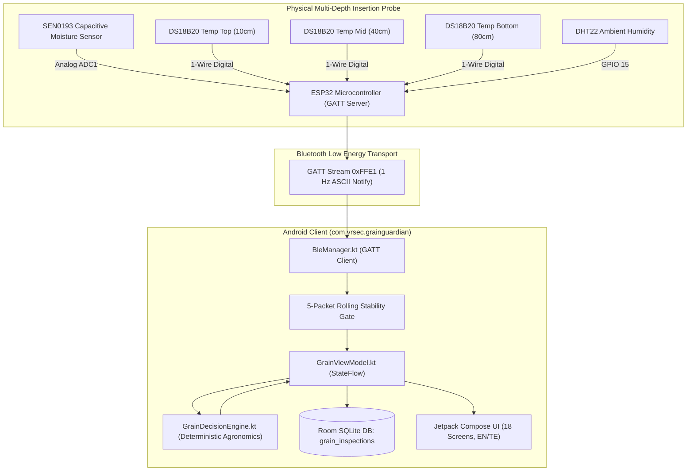

<div align="center">

# 🌾 GrainGuardian (పంట రక్షకుడు)
### *Smart Paddy Post-Harvest Readiness, 3-Depth Thermal Stratification & Storage Health Intelligence System*

[](https://github.com/nleelaranga-ai/grain_guardian_app)
[-3DDC84?style=for-the-badge&logo=android&logoColor=white)](https://developer.android.com)
[](https://kotlinlang.org)
[](https://developer.android.com/jetpack/compose)
[](https://www.espressif.com)
[](https://developer.android.com/training/data-storage/room)
[](#-bilingual-localization-english--తెలుగు)
[](LICENSE)

<br />


</div>

---

## 📑 Executive Summary

In traditional paddy post-harvest management, smallholder farmers rely on crude sensory heuristics (biting grains, fingernail indentation, feeling grain temperature with palms). This causes catastrophic agronomic and economic losses:
1. **Premature Bagging & Storage ($>14\%$ Moisture)**: Grain packed at $>14\%$ moisture develops internal hot spots, triggering rapid colonization by *Aspergillus flavus* and carcinogenic **Aflatoxin B1 contamination** within 48–72 hours.
2. **Excessive Sun Drying ($<12\%$ Moisture)**: Over-drying induces fissure stress cracks in the endosperm, causing **25–30% grain breakage** during commercial milling (*Head Rice Yield* collapse).
3. **Invisible Internal Bag Spoilage**: Deep within 50 kg or 75 kg grain piles, thermal gradients trap moisture migration, destroying grain germination viability without outward signs.

**GrainGuardian** resolves this by pairing a custom **multi-depth insertion probe** (capacitive moisture + 3x digital temperature sensors + ambient humidity) via **Bluetooth Low Energy (BLE GATT)** with a native **Android client (`com.vrsec.grainguardian`)**. It operates **100% offline with zero cloud dependency**, ensuring reliable field operation in rural farming clusters and remote warehouses.

---

## 🏛️ System Architecture & Data Flow

The system adheres to **Clean Architecture** and **Unidirectional Data Flow (UDF)**:



---

## ✨ Key Capabilities & Engineering Highlights

### 1. Truthful Hardware Integrity (Zero Fake Connections)
- **Authentic BLE Client:** Built using Android's native `BluetoothLeScanner` and GATT callback lifecycle.
- **Truthful Offline State:** The dashboard explicitly shows `● No Probe Connected` (`● ప్రోబ్ కనెక్ట్ కాలేదు`) when physical hardware is absent.
- **Gated Workflow:** Measurement flows cannot be triggered without a verified physical hardware handshake.
- **Developer Sandbox Mode:** An isolated laboratory emulator in Settings protected by a prominent warning banner (`⚠️ డెవలపర్ సాండ్‌బాక్స్ మోడ్ యాక్టివ్ / Developer Sandbox Mode Active`) for demonstrations when the physical probe is unavailable.

### 2. Mathematical Real-Time Stability Filter
Grain insertion creates frictional heat and capacitive boundary shifts. GrainGuardian buffers telemetry across a **5-reading rolling window** and only unlocks results when physical equilibrium is confirmed:
$$\Delta M = \max_{i=1..5}(M_i) - \min_{i=1..5}(M_i) < 0.25\%$$
$$\Delta T = \max_{i=1..5}(T_{2,i}) - \min_{i=1..5}(T_{2,i}) < 0.35^\circ\text{C}$$

### 3. Deterministic Agronomic Decision Engine
All stochastic and random simulations have been completely purged:
- **Moisture Deviation:** $\Delta M = M_{\text{measured}} - 13.5\%$ (Paddy Safe Storage Limit).
- **Thermal Gradient Index (TGI):** $\text{TGI} = |T_{\text{bottom}} - T_{\text{top}}| = |T_3 - T_1|$
  - $\text{TGI} > 4.0^\circ\text{C}$ indicates severe internal convection and condensation hazard.
- **Biological Degradation Risk Score (BDRS, 0–100):**
  $$\text{BDRS} = 0.50 \cdot f(M) + 0.30 \cdot f(T_2) + 0.20 \cdot f(\text{TGI})$$
  - $f(M) = \min\left(100, \; \max\left(0, \; (M - 13.5) \times 20\right)\right)$
  - $f(T_2) = \min\left(100, \; \max\left(0, \; (T_2 - 28.0) \times 7.14\right)\right)$
  - $f(\text{TGI}) = \min\left(100, \; \max\left(0, \; (\text{TGI} - 2.0) \times 33.3\right)\right)$
- **Grain Storage Health Index (GSHI):** $\text{GSHI} = 100 - \text{BDRS}$
- **Solar Sun-Drying Time:** $t_{\text{drying}} = \max\left(0, \; \text{round}\left((M_{\text{measured}} - 13.5) \times 2.5\right)\right) \text{ hours}$

### 4. 100% Offline SQLite Room Persistence
- Stores all historical inspections in the `grain_inspections` table.
- 17 telemetry fields per record ($M, T_1, T_2, T_3, H, B$, BDRS, Drying Hours, Storage Life, Summaries).
- Clean database on fresh install with an on-demand **Benchmark Loader** in Settings.

### 5. Instant Telugu (తెలుగు) Localization
- Dynamic bidirectional language switching via Compose `StateFlow`.
- Zero-restart instant UI recomposition across all 18 screens.
- Authentic agricultural terminology (e.g., ధాన్యం తేమ శాతం, బస్తాలు తిరగేయడం, సూర్యరశ్మి ఆరబెట్టడం).

---

## 📱 Pin-to-Pin Screen Portfolio (18 Screens)

| # | Screen Name | Kotlin Implementation | Function & Architectural Role | Telugu Localization |
| :- | :--- | :--- | :--- | :--- |
| **1** | **Splash** | [`SplashScreen.kt`](app/src/main/java/com/vrsec/grainguardian/ui/screens/SplashScreen.kt) | Sheaf animation, 1800ms timer; routes to setup or Dashboard. | పంట రక్షకుడు |
| **2** | **Language Setup** | [`LanguageSelectionScreen.kt`](app/src/main/java/com/vrsec/grainguardian/ui/screens/LanguageSelectionScreen.kt) | High-contrast bilingual picker (English / తెలుగు). | భాషను ఎంచుకోండి |
| **3** | **Welcome** | [`WelcomeScreen.kt`](app/src/main/java/com/vrsec/grainguardian/ui/screens/WelcomeScreen.kt) | Farmer onboarding on moisture safety & thermal hot spots. | రైతు పోర్టల్ ప్రారంభించండి |
| **4** | **Dashboard** | [`DashboardScreen.kt`](app/src/main/java/com/vrsec/grainguardian/ui/screens/DashboardScreen.kt) | Live probe status chip, Grain Health Score (0–100), quick CTAs. | ప్రధాన డాష్‌బోర్డ్ |
| **5** | **Crop Selection** | [`CropSelectionScreen.kt`](app/src/main/java/com/vrsec/grainguardian/ui/screens/CropSelectionScreen.kt) | Configures thresholds: Paddy (13.5%), Maize (14.0%), Wheat (12.5%), Pulses (10.0%). | పంట రకం ఎంపిక |
| **6** | **Mode Selection** | [`AssessmentSelectionScreen.kt`](app/src/main/java/com/vrsec/grainguardian/ui/screens/AssessmentSelectionScreen.kt) | Pre-storage Drying Readiness vs Bagged Storage Pile Health. | ఆరబెట్టే సంసిద్ధత / నిల్వ |
| **7** | **Connect Probe** | [`ConnectProbeScreen.kt`](app/src/main/java/com/vrsec/grainguardian/ui/screens/ConnectProbeScreen.kt) | Real Android BLE scanner; Bluetooth state alerts; sandbox emulator. | ప్రోబ్‌ను కనెక్ట్ చేయండి |
| **8** | **Prepare Check** | [`PrepareMeasurementScreen.kt`](app/src/main/java/com/vrsec/grainguardian/ui/screens/PrepareMeasurementScreen.kt) | 3-step physical insertion protocol (vertical, 15s settle, steady hold). | కొలతకు సిద్ధం చేయండి |
| **9** | **Live Measurement** | [`LiveMeasurementScreen.kt`](app/src/main/java/com/vrsec/grainguardian/ui/screens/LiveMeasurementScreen.kt) | Real-time packet telemetry, 3-depth temps, 5-packet stability check. | ప్రత్యక్ష కొలత |
| **10** | **Drying Result** | [`DryingResultScreen.kt`](app/src/main/java/com/vrsec/grainguardian/ui/screens/DryingResultScreen.kt) | Safe to Store vs Further Drying verdict; exact solar drying hours. | ఆరబెట్టే ఫలితం |
| **11** | **Storage Result** | [`StorageResultScreen.kt`](app/src/main/java/com/vrsec/grainguardian/ui/screens/StorageResultScreen.kt) | 3-depth thermal stratification; $\text{TGI}$ gradient index; risk level. | నిల్వ ఫలితం |
| **12** | **Risk Analysis** | [`RiskAnalysisScreen.kt`](app/src/main/java/com/vrsec/grainguardian/ui/screens/RiskAnalysisScreen.kt) | $\text{BDRS}$ score breakdown & Critical Limiting Parameter. | ప్రమాద విశ్లేషణ |
| **13** | **Advisory** | [`RecommendationScreen.kt`](app/src/main/java/com/vrsec/grainguardian/ui/screens/RecommendationScreen.kt) | Localized farmer advisory; SQLite DB save trigger. | రైతు కార్యాచరణ సలహా |
| **14** | **History** | [`InspectionHistoryScreen.kt`](app/src/main/java/com/vrsec/grainguardian/ui/screens/InspectionHistoryScreen.kt) | Searchable historical inspection log with risk badges. | పరీక్ష రికార్డులు |
| **15** | **Details** | [`InspectionDetailsScreen.kt`](app/src/main/java/com/vrsec/grainguardian/ui/screens/InspectionDetailsScreen.kt) | Full audit of all 5 sensor streams and recommendation given. | రికార్డు వివరాలు |
| **16** | **Knowledge Base** | [`HelpScreen.kt`](app/src/main/java/com/vrsec/grainguardian/ui/screens/HelpScreen.kt) | Agronomic guides: moisture charts, probe care, aflatoxin prevention. | సహాయ కేంద్రం |
| **17** | **Lab Sandbox** | [`SettingsScreen.kt`](app/src/main/java/com/vrsec/grainguardian/ui/screens/SettingsScreen.kt) | Protected developer sandbox with high-contrast safety alerts; benchmark loader. | డెవలపర్ సాండ్‌బాక్స్ |
| **18** | **Diagnostics** | [`DeviceInfoScreen.kt`](app/src/main/java/com/vrsec/grainguardian/ui/screens/DeviceInfoScreen.kt) | Firmware telemetry, 4 independent sensor health checks. | పరికర సమాచారం |

---

## 📡 BLE Telemetry Protocol & GATT Blueprint

* **Microcontroller**: ESP32-WROOM-32 (GATT Server)
* **GATT Service UUID**: `0000FFE0-0000-1000-8000-00805F9B34FB` (16-bit alias: `0xFFE0`)
* **Characteristic UUID**: `0000FFE1-0000-1000-8000-00805F9B34FB` (16-bit alias: `0xFFE1`, Property: `NOTIFY`)
* **CCCD UUID**: `00002902-0000-1000-8000-00805F9B34FB`
* **Stream Rate**: 1 Packet per second (1 Hz)

### ASCII Telemetry Packet Structure
```text
M:<moisture>,T1:<top>,T2:<middle>,T3:<bottom>,H:<humidity>,B:<battery>\n
```
*Example Stream:*
```text
M:14.2,T1:31.5,T2:33.2,T3:34.8,H:68.5,B:92
M:14.1,T1:31.5,T2:33.3,T3:34.7,H:68.4,B:92
M:14.2,T1:31.4,T2:33.2,T3:34.8,H:68.5,B:91
```

---

## 🛠️ Hardware Blueprint & Circuit Schematic

```text
+-------------------------------------------------------------+
|                     ESP32-WROOM-32                          |
|                                                             |
|   [GPIO 34] <--- Analog Out <--- SEN0193 Moisture Sensor   |
|   [GPIO  4] <--- 1-Wire DQ  <--- 3x DS18B20 Temp Sensors    |
|                  (with 4.7kΩ pull-up resistor to 3.3V)      |
|   [GPIO 15] <--- Data Pin   <--- DHT22 Ambient Temp/Hum     |
|   [GPIO 35] <--- Mid-point  <--- 100k/100k Voltage Divider  |
|                                  (from 18650 Li-ion 3.7V)   |
|   [ 3.3V  ] ---> VCC to all sensors                         |
|   [  GND  ] ---> Common Ground                              |
+-------------------------------------------------------------+
```

### Complete ESP32 Arduino C++ Firmware Sketch

```cpp
#include <BLEDevice.h>
#include <BLEServer.h>
#include <BLEUtils.h>
#include <BLE2902.h>
#include <OneWire.h>
#include <DallasTemperature.h>
#include <DHT.h>

#define SERVICE_UUID        "0000FFE0-0000-1000-8000-00805F9B34FB"
#define CHARACTERISTIC_UUID "0000FFE1-0000-1000-8000-00805F9B34FB"

#define MOISTURE_PIN 34
#define ONE_WIRE_BUS 4
#define DHTPIN 15
#define DHTTYPE DHT22
#define BATTERY_PIN 35

OneWire oneWire(ONE_WIRE_BUS);
DallasTemperature dsSensors(&oneWire);
DHT dht(DHTPIN, DHTTYPE);

BLEServer* pServer = NULL;
BLECharacteristic* pCharacteristic = NULL;
bool deviceConnected = false;

class ServerCallbacks: public BLEServerCallbacks {
    void onConnect(BLEServer* pServer) { deviceConnected = true; }
    void onDisconnect(BLEServer* pServer) { 
        deviceConnected = false;
        pServer->startAdvertising(); 
    }
};

void setup() {
    Serial.begin(115200);
    dsSensors.begin();
    dht.begin();
    analogReadResolution(12);

    BLEDevice::init("GrainGuardian-01");
    pServer = BLEDevice::createServer();
    pServer->setCallbacks(new ServerCallbacks());

    BLEService *pService = pServer->createService(SERVICE_UUID);
    pCharacteristic = pService->createCharacteristic(
        CHARACTERISTIC_UUID,
        BLECharacteristic::PROPERTY_NOTIFY
    );
    pCharacteristic->addDescriptor(new BLE2902());
    pService->start();

    BLEAdvertising *pAdvertising = BLEDevice::getAdvertising();
    pAdvertising->addServiceUUID(SERVICE_UUID);
    pAdvertising->setScanResponse(true);
    BLEDevice::startAdvertising();
}

void loop() {
    if (deviceConnected) {
        int rawMoist = analogRead(MOISTURE_PIN);
        float moisture = map(rawMoist, 3100, 1400, 90, 240) / 10.0;
        if (moisture < 8.0) moisture = 8.0;
        if (moisture > 35.0) moisture = 35.0;

        dsSensors.requestTemperatures();
        float tTop = dsSensors.getTempCByIndex(0);
        float tMid = dsSensors.getTempCByIndex(1);
        float tBot = dsSensors.getTempCByIndex(2);
        if (tTop < -50) tTop = 30.0;
        if (tMid < -50) tMid = 31.5;
        if (tBot < -50) tBot = 32.8;

        float hum = dht.readHumidity();
        if (isnan(hum)) hum = 65.0;

        int rawBat = analogRead(BATTERY_PIN);
        int battery = map(rawBat, 2048, 2800, 0, 100);
        if (battery < 0) battery = 0;
        if (battery > 100) battery = 100;

        char packet[64];
        snprintf(packet, sizeof(packet), "M:%.1f,T1:%.1f,T2:%.1f,T3:%.1f,H:%.1f,B:%d",
                 moisture, tTop, tMid, tBot, hum, battery);

        pCharacteristic->setValue((uint8_t*)packet, strlen(packet));
        pCharacteristic->notify();
        Serial.println(packet);
    }
    delay(1000);
}
```

---

## 📂 Project Repository Structure

```text
grain_guardian_app/
├── app/
│   ├── build.gradle.kts              # Dependencies: Compose BOM, Room KSP, Coroutines, BLE
│   └── src/main/
│       ├── AndroidManifest.xml       # BLE & Location permissions
│       └── java/com/vrsec/grainguardian/
│           ├── data/
│           │   ├── bluetooth/BleManager.kt       # Android BluetoothLeScanner & GATT Client
│           │   ├── database/                     # Room SQLite: GrainGuardianDatabase.kt
│           │   ├── model/                        # Domain entities: GrainInspectionEntity.kt
│           │   └── repository/                   # Clean repository: InspectionRepository.kt
│           ├── domain/
│           │   ├── engine/GrainDecisionEngine.kt # Deterministic mathematics (BDRS, TGI, GSHI)
│           │   └── localization/                 # Bilingual Telugu/English engine
│           ├── ui/
│           │   ├── components/                   # CircularGauge, RiskMeter, StatusBadge
│           │   ├── navigation/                   # GrainNavigation.kt, Screen.kt (18 routes)
│           │   ├── screens/                      # 18 Modular Jetpack Compose Screens
│           │   └── theme/                        # Material 3 Color, Theme & Typography
│           ├── viewmodel/                        # GrainViewModel.kt & Factory
│           ├── GrainGuardianApp.kt               # Application entry & DB init
│           └── MainActivity.kt                   # Activity & runtime permissions
├── gradle/                                   # Gradle wrapper
├── build.gradle.kts                          # Root build script
├── settings.gradle.kts
├── PROJECT_MASTER_PIN_TO_PIN.md              # Complete Pin-to-Pin System Dossier
├── APP_STATUS.md                             # Production System Status
└── README.md                                 # Master Documentation
```

---

## ⚡ Build & Installation

### Prerequisites
* **Android Studio**: Hedgehog (2023.1.1) or newer
* **JDK**: OpenJDK 17 (Recommended: Android Studio bundled JBR)
* **Target SDK**: 33 (Android 13) | **Min SDK**: 26 (Android 8.0 Oreo)

### Build Commands
```bash
# Clone the repository
git clone https://github.com/nleelaranga-ai/grain_guardian_app.git
cd grain_guardian_app

# Build debug APK via Gradle Wrapper
./gradlew assembleDebug

# Install on connected device or emulator
adb install -r app/build/outputs/apk/debug/app-debug.apk
```

---

## 📜 License & Acknowledgments

Distributed under the **MIT License**.  
**Lead Developer & Systems Architect**:  
**LEELA RANGA PRASAD** (`nleelaranga-ai`) • [GitHub](https://github.com/nleelaranga-ai) • [LinkedIn](https://linkedin.com/in/leela-ranga-prasad-ba4936214) • [Email](mailto:n.leelaranga@gmail.com)
