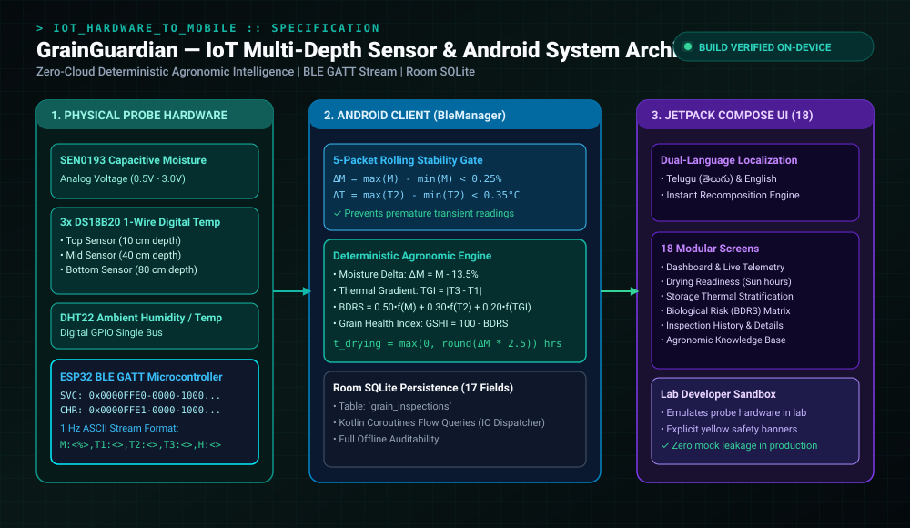
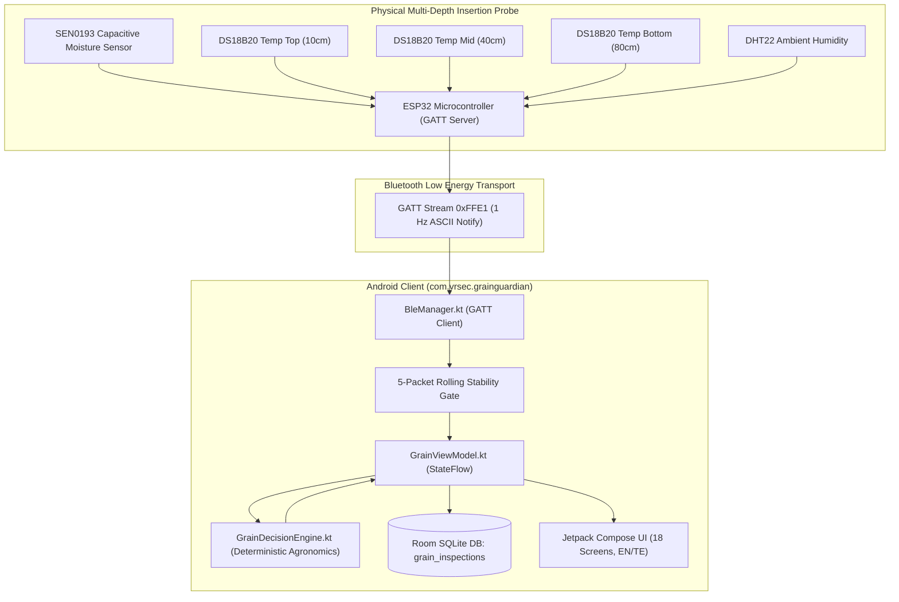

<div align="center">

# 🌾 GrainGuardian AI — Hardware-to-Mobile Paddy Post-Harvest & Storage Intelligence System

**పంట రక్షకుడు | Smart Post-Harvest Readiness, 3-Depth Thermal Stratification & Aflatoxin Prevention Platform**

[](https://github.com/nleelaranga-ai/GrainGuardian-AI)
[](https://kotlinlang.org)
[](https://developer.android.com/jetpack/compose)
[](https://www.espressif.com)
[](https://developer.android.com/training/data-storage/room)
[](LICENSE)

<br />



</div>

---

## 📑 Executive Summary

In traditional paddy post-harvest management, smallholder farmers rely on crude sensory heuristics (biting grains, fingernail indentation, feeling grain temperature with palms). This causes catastrophic agronomic and economic losses:
1. **Premature Bagging & Storage**: Grain packed at $>14\%$ moisture develops internal hot spots, triggering rapid colonization by *Aspergillus flavus* and carcinogenic **Aflatoxin contamination** within 48–72 hours.
2. **Excessive Sun Drying**: Over-drying ($<12\%$ moisture) induces fissure cracks in the endosperm, causing **25–30% grain breakage** during commercial milling (*Head Rice Yield* collapse).
3. **Invisible Internal Bag Spoilage**: Deep within 50 kg or 75 kg grain piles, thermal gradients trap moisture migration, destroying grain germination viability.

**GrainGuardian** resolves this by pairing a custom **multi-depth insertion probe** (capacitive moisture + 3x digital temperature sensors + ambient humidity) via **Bluetooth Low Energy (BLE GATT)** with a native **Android client (`com.vrsec.grainguardian`)**. It operates **100% offline with zero cloud dependency**, ensuring reliable field operation in rural farming clusters and remote warehouses.

---

## 🏛️ System Architecture & Data Flow

The system adheres to **Clean Architecture** and **Unidirectional Data Flow (UDF)**:



---

## 🧮 Deterministic Agronomic Mathematical Models

To ensure complete reliability in the field, **all stochastic guesswork and random simulations have been eliminated**. The decision engine implements exact mathematical formulations:

### 1. Stability Gating Function
To prevent premature or transient readings while the probe settles into the grain bag, a 5-packet rolling window must satisfy:
$$\Delta M = \max_{i=1..5}(M_i) - \min_{i=1..5}(M_i) < 0.25\%$$
$$\Delta T = \max_{i=1..5}(T_{2,i}) - \min_{i=1..5}(T_{2,i}) < 0.35^\circ\text{C}$$

### 2. Thermal Gradient Index ($\text{TGI}$)
Measures thermal convection between the deep core and outer surface:
$$\text{TGI} = |T_3 - T_1|$$
* If $\text{TGI} > 4.0^\circ\text{C}$, severe moisture migration and hot-spot risks are declared.

### 3. Biological Degradation Risk Score ($\text{BDRS}$)
A weighted index scoring the risk of mold and insect germination:
$$\text{BDRS} = 0.50 \cdot f(M) + 0.30 \cdot f(T_2) + 0.20 \cdot f(\text{TGI})$$
Where:
* $f(M) = \min\left(100, \; \max\left(0, \; (M - 13.5) \times 20\right)\right)$
* $f(T_2) = \min\left(100, \; \max\left(0, \; (T_2 - 28.0) \times 7.14\right)\right)$
* $f(\text{TGI}) = \min\left(100, \; \max\left(0, \; (\text{TGI} - 2.0) \times 33.3\right)\right)$

$$\text{Grain Storage Health Index (GSHI)} = 100 - \text{BDRS}$$

### 4. Solar Drying Time Calculation
$$t_{\text{drying}} = \max\left(0, \; \text{round}\left((M_{\text{measured}} - 13.5\%) \times 2.5\right)\right) \text{ hours}$$

---

## 📱 Pin-to-Pin Screen Portfolio (18 Screens)

| # | Screen Name | Kotlin Implementation | Function & Architectural Role | Telugu Localization |
| :- | :--- | :--- | :--- | :--- |
| **1** | **Splash** | `SplashScreen.kt` | Sheaf animation, 1800ms timer; routes to setup. | పంట రక్షకుడు |
| **2** | **Language Setup** | `LanguageSelectionScreen.kt` | High-contrast bilingual picker (English / తెలుగు). | భాషను ఎంచుకోండి |
| **3** | **Welcome** | `WelcomeScreen.kt` | Farmer onboarding on moisture safety & thermal hot spots. | రైతు పోర్టల్ ప్రారంభించండి |
| **4** | **Dashboard** | `DashboardScreen.kt` | Live probe status chip, Grain Health Score (0–100). | ప్రధాన డాష్‌బోర్డ్ |
| **5** | **Crop Selection** | `CropSelectionScreen.kt` | Configures thresholds: Paddy (13.5%), Maize (14%), Wheat. | పంట రకం ఎంపిక |
| **6** | **Mode Selection** | `AssessmentSelectionScreen.kt` | Pre-storage Drying Readiness vs Bagged Storage Pile Health. | ఆరబెట్టే సంసిద్ధత / నిల్వ |
| **7** | **Connect Probe** | `ConnectProbeScreen.kt` | Real Android BLE scanner; Bluetooth state alerts. | ప్రోబ్‌ను కనెక్ట్ చేయండి |
| **8** | **Prepare Check** | `PrepareMeasurementScreen.kt` | 3-step physical insertion protocol (vertical, 15s settle). | కొలతకు సిద్ధం చేయండి |
| **9** | **Live Measurement** | `LiveMeasurementScreen.kt` | Real-time packet telemetry, 3-depth temps, stability check. | ప్రత్యక్ష కొలత |
| **10** | **Drying Result** | `DryingResultScreen.kt` | Safe to Store vs Further Drying verdict; exact sun hours. | ఆరబెట్టే ఫలితం |
| **11** | **Storage Result** | `StorageResultScreen.kt` | 3-depth thermal stratification; $\text{TGI}$ gradient index. | నిల్వ ఫలితం |
| **12** | **Risk Analysis** | `RiskAnalysisScreen.kt` | $\text{BDRS}$ score breakdown & Critical Limiting Parameter. | ప్రమాద విశ్లేషణ |
| **13** | **Advisory** | `RecommendationScreen.kt` | Localized farmer advisory; SQLite DB save trigger. | రైతు కార్యాచరణ సలహా |
| **14** | **History** | `InspectionHistoryScreen.kt` | Searchable historical inspection log with risk badges. | పరీక్ష రికార్డులు |
| **15** | **Details** | `InspectionDetailsScreen.kt` | Full audit of all 5 sensor streams and recommendation. | రికార్డు వివరాలు |
| **16** | **Knowledge Base** | `HelpScreen.kt` | Agronomic guides: moisture charts, probe care. | సహాయ కేంద్రం |
| **17** | **Lab Sandbox** | `SettingsScreen.kt` | Protected developer sandbox with high-contrast safety alerts. | డెవలపర్ సాండ్‌బాక్స్ |
| **18** | **Diagnostics** | `DeviceInfoScreen.kt` | Firmware telemetry, 5 independent sensor health checks. | పరికర సమాచారం |

---

## 📡 BLE Telemetry Protocol & GATT Blueprint

* **Microcontroller**: ESP32 BLE (GATT Server)
* **GATT Service UUID**: `0000FFE0-0000-1000-8000-00805F9B34FB`
* **Characteristic UUID**: `0000FFE1-0000-1000-8000-00805F9B34FB` (Notify, 1 Hz)
* **Stream Packet Format**:
  ```text
  M:14.2,T1:31.2,T2:34.8,T3:32.1,H:68.5,B:92
  ```

---

## 📂 Project Repository Structure

```
GrainGuardian-AI/
├── app/
│   ├── build.gradle.kts              # Dependencies: Compose, Room, Coroutines, BLE
│   └── src/main/java/com/vrsec/grainguardian/
│       ├── data/
│       │   ├── bluetooth/BleManager.kt       # Android BluetoothLeScanner & GATT Client
│       │   ├── database/                     # Room SQLite: GrainGuardianDatabase.kt
│       │   ├── model/                        # Domain entities: GrainInspectionEntity.kt
│       │   └── repository/                   # Clean repository: InspectionRepository.kt
│       ├── domain/
│       │   ├── engine/GrainDecisionEngine.kt # Deterministic mathematics (BDRS, TGI, GSHI)
│       │   └── localization/                 # Bilingual Telugu/English engine
│       ├── ui/
│       │   ├── components/                   # CircularGauge, RiskMeter, StatusBadge
│       │   ├── navigation/                   # GrainNavigation.kt, Screen.kt (18 routes)
│       │   ├── screens/                      # 18 Modular Jetpack Compose Screens
│       │   └── theme/                        # Material 3 Color, Theme & Typography
│       ├── viewmodel/                        # GrainViewModel.kt & Factory
│       ├── GrainGuardianApp.kt               # Application entry & DB init
│       └── MainActivity.kt                   # Activity & runtime permissions
├── gradle/                                   # Gradle wrapper
├── build.gradle.kts                          # Root build script
├── settings.gradle.kts
└── README.md
```

---

## ⚡ Build & Installation

### Build with Android Studio / Gradle

```bash
# Clone the repository
git clone https://github.com/nleelaranga-ai/GrainGuardian-AI.git
cd GrainGuardian-AI

# Build the release APK via Gradle Wrapper
./gradlew assembleRelease

# Install on a connected Android device (minSdk 26, targetSdk 33)
./gradlew installDebug
```

---

## 📜 License & Acknowledgments

Distributed under the **MIT License**.  
**Lead Developer & Systems Architect**:  
**LEELA RANGA PRASAD** (`nleelaranga-ai`) • [LinkedIn](https://linkedin.com/in/leela-ranga-prasad-ba4936214) • [Email](mailto:n.leelaranga@gmail.com)
